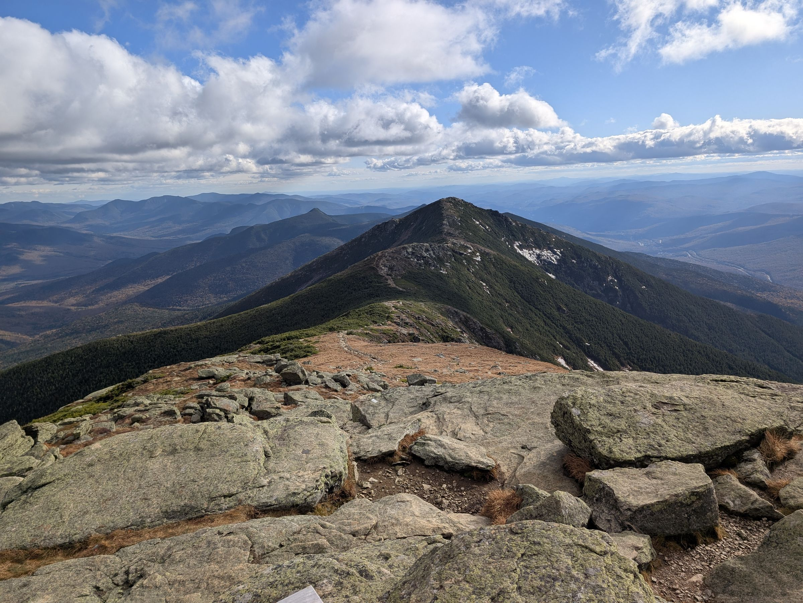

```{r}
#| include: false
source(file.path(Sys.getenv("QUARTO_PROJECT_DIR", "."), "R", "site.R"))
check_navbar_links()
```

::: {.column-screen .hero-banner}
{fig-alt="Alpine ridge trail stretching toward a distant peak under a partly cloudy sky"}
:::

::: {.grid .home-grid}

::: {.g-col-12 .g-col-md-4 .home-side}
{.headshot fig-alt="Headshot of Amelia Miramonti"}

[<i class="bi bi-file-earmark-person" aria-hidden="true"></i> CV](cv/index.qmd){.btn .btn-primary .w-100 .mb-2}
```{r}
#| results: asis
cat(link_button("github"), link_button("linkedin"), link_button("orcid"),
    link_button("scholar"), sep = "
")
```

[<i class="bi bi-envelope" aria-hidden="true"></i> Email](contact.qmd){.btn .btn-outline-primary .w-100 .mb-2}
:::

::: {.g-col-12 .g-col-md-8}

::: {.callout-tip appearance="simple"}
**At posit::conf(2026) this week.** Come say hi! [What I'd love to chat about](posit-conf-2026.qmd).
:::

Hi, I'm Amelia! I'm a postdoctoral researcher and adjunct faculty member at the University of Nebraska–Lincoln. I work in the Nebraska Evaluation and Research (NEAR) Center, a statistics and data consulting center, and partner with the University of Nebraska Public Policy Center (NUPPC) and the Nebraska Statewide Workforce and Educational Reporting System (NSWERS), Nebraska's statewide longitudinal data system. I also teach data management and survey methods to graduate students.

My training spans several fields. I started in sport and exercise science, with a BSc and an MSc from the University of Central Florida; my master's thesis examined how high-intensity interval training and HMB supplementation affect neuromuscular fatigue. At UNL I earned a second master's, an MA in Quantitative, Qualitative, and Psychometric Methods, and then an interdisciplinary PhD (2025) that paired those methods with exercise physiology and nutrition. My dissertation looked at youth sport participation and cognitive development, and at the better measurement needed to study them.

That range shows up in the work I've contributed to. Much of my early research is in exercise physiology and strength and conditioning: neuromuscular responses to training measured with electromyography and mechanomyography, interval and resistance training, sports nutrition, and athletic performance testing from youth to older adults, in journals such as the *Journal of Strength & Conditioning Research*, *European Journal of Applied Physiology*, *Muscle & Nerve*, and *Experimental Gerontology*. Since then my work has extended to child nutrition, career and counseling psychology, and educational and developmental research, shared in outlets like *Childhood Obesity* and the *Journal of Career Assessment* and at AERA, APA, and ISBNPA meetings, along with methods work on missing data and measurement invariance.

These days much of my time goes to building R and Shiny tools that make messy administrative data easier to document, clean, and report on, and to generating privacy-preserving synthetic data. See my [publications](publications.qmd) and [talks](talks.qmd) for the full list.

I'd love to connect.

## Currently

```{r}
#| results: asis
pos <- cv_data("positions")
# Prefer the `current` flag in the data. Older data files lack it, so fall back
# to the same rule: the date range ends in "present" after an en dash, hyphen,
# or "to".
is_cur <- if ("current" %in% names(pos)) {
  pos$current %in% TRUE
} else {
  grepl("(?i)(–|-|\\bto)\\s*present\\s*$", pos$dates, perl = TRUE)
}
cur <- pos[is_cur, ]
for (i in seq_len(nrow(cur))) {
  cat("- **", md(cur$title[i]), "**, ", md(cur$unit[i]), " (", md(cur$dates[i]), ")\n", sep = "")
}
```

:::

:::
