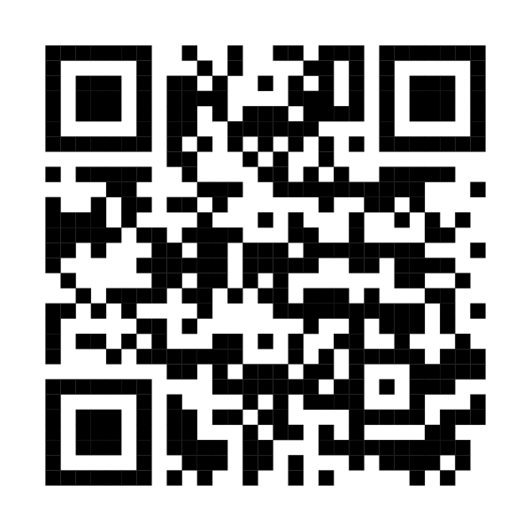

I'm attending this year and would love to meet people. Things I'm always happy to talk about:

- **Shiny apps for messy data**: cleaning string variables, inferring table relationships, documenting data warehouses ([Recode Studio](https://github.com/amelia-m/recode-studio), [Table Relationship Explorer](https://github.com/amelia-m/table-explorer))
- **Synthetic data** for sharing administrative records safely
- **Teaching data management and R** to graduate students
- **Quarto** for course sites, reports, and parameterized reporting
- **R in public-sector and evaluation work**

Best ways to follow up: [LinkedIn](https://www.linkedin.com/in/amelia-miramonti/), [Bluesky](https://bsky.app/profile/ameliamiramonti.bsky.social), or [email](contact.qmd).

::: {.qr-block}
{width=220 fig-alt="QR code linking to amelia-m.github.io"}

**amelia-m.github.io**
:::
